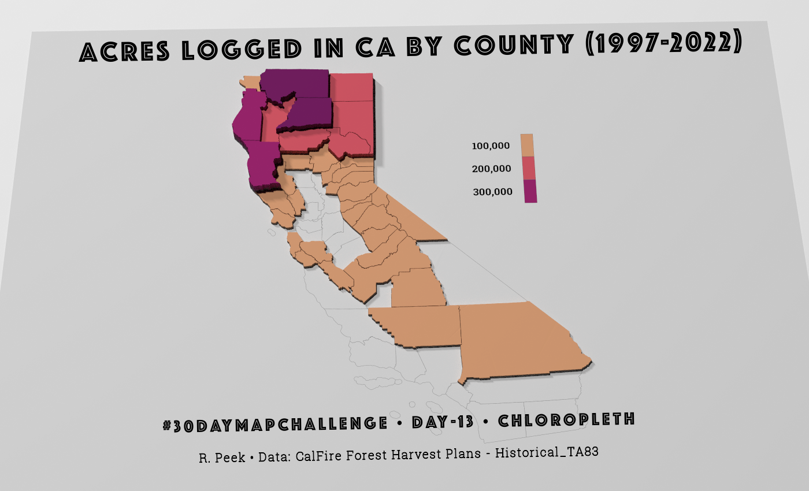
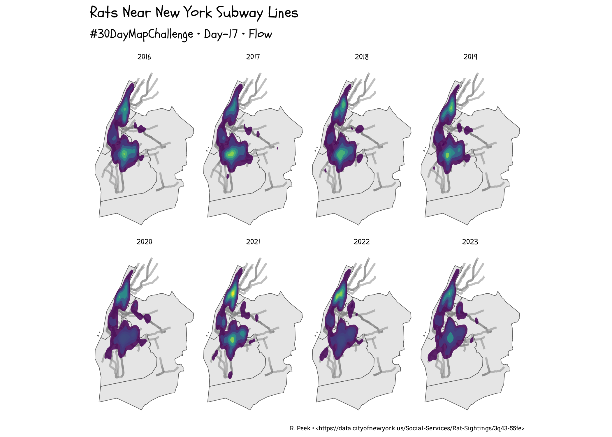
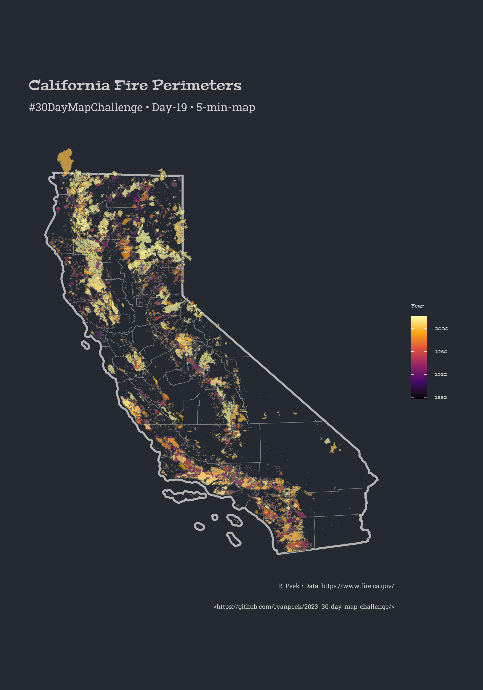

# 2023_30-day-map-challenge

[30-day map challenge](https://30daymapchallenge.com/)

*create maps based around different themes each day of November using the hashtag `#30DayMapChallenge`*

## Here's What I've Done

### Day-01

Where in the western US have porcupines been observed using {tigris} and {rinat} to gather boundaries and data points.

### Day-02

A flow-field/lines rendering of a photo of my grandmother in honor of Día de los Muertos.

### Day-03

Words for pollywog or tadpole across the world. The etymology may be rooted in Middle English, where `tadpole` is from *tadde* “toad” and *pol* “head”. For  `pollywog`, it's possibly from the *pol* "head" and *wyglen* “to wiggle”.

Expert sources were the internet, wikipedia, and dictionaries.

### Day-04

Timezones are scary. Having to switch our clocks twice a year is scarier.

### Day-05

When CA was an island...in 1650.

### Day-06

Light intensity at night in India, based on Nature article: https://www.nature.com/articles/s41597-020-0510-y.

### Day-07

Maps tell stories as well as help one navigate. While we have many maps of post-colonial trails, it is much harder to find data that documents Indigenous places, trails, and knowledge. It is not that these don't exist, they just don't get put on maps. 

A recent effort to provide an interactive GIS map of indigenous resources to help advance knowledge of Indigenous ancestral lands is called [Native Lands National Trails](https://experience.arcgis.com/experience/c98b415eb4b44081a6dcb9e824785846/page/NLNT-Homepage/). This is in part to help advance National Trails System knowledge of Indigenous ancestral Lands and increase partnerships and collaboration with Indigenous Communities along National Scenic and National Historic Trails.

I highly recommend checking out the map and reading the resources section and read the acknowledgement statement.^[Also look at the beautiful logo designed by Autry Lomahongva!].

### Day-08

African ocean currents!

### Day-09

30x30 Wildlife connectivity (in hexagons).

### Day-10

Longest roads...of North America. A quick visual assessment of the longest road segments from the TIGRIS database, primary roads in the US, and all roads > 5 miles long in CA.

### Day-11

Retro! Maps of Middle Earth. Heavily inspired and revising code from [this post by Andrew Heiss](https://www.andrewheiss.com/blog/2023/04/26/middle-earth-mapping-sf-r-gis/)

### Day-12

Some webscraping from wikipedia and tidygeocoder to get lat/longs, and a map of South American soccer stadiums!

### Day-13

Chloropleth of logging in CA summarized by county from 1997-2022

### Day-14

Degree of Regulation in Ireland (including Northern Ireland) based on HydroSHED RiverATLAS data. Few rivers have much of any degree of regulation save a few. 

### Day-15

Open Street Map. I've made it halfway! This is the Rae Lakes loop in SEKI.

### Day-16

Oceania: GSOD Climate stations that have precip, and temperature data. Polar plots are a little rough but it will have to do until another time.

### Day-17

Flow! Of Rats via Subways. Not sure this all fits together, but data was fun to play with.

### Day-18

Atmosphere. A measure of drought (EDDI) which is an indicator of atmospheric thirst. Comparing 2022 (a drought year) with 2023, one of the wettest years CA has had. Hotter (higher) values indicate stronger aridity.

### Day-19

5 min map. This took a bit longer to render and save, but data from CalFire are fire perimeters. Colored by year of fire.

### Day-20

Outdoors. One of the coolest geologic/glacial features in the Sierras is the Kern Plateau...and in particular the Upper Kern Watershed. This is a map of terrain ruggedness, which gives a sense of the glacial "U" shape of many of the side valleys.

### Day-21

Auburn State Park (Recreational Area). Deep canyons and great places to hike. Used {rayshader} and {elevatr} here.

### Day-22

North is Not Up! Or also, rivers don't always flow south (or west) in CA. 

### Day-23

3D: Forest Canopy Height (see here: https://langnico.github.io/globalcanopyheight/) for Emigrant Wilderness.

### Day-24

Black and White: as light pollution.

### Day-25

Antarctica. Location of the {palmerpenguins} data set, as gleaned from the original paper. And with art from Allison Horst!

