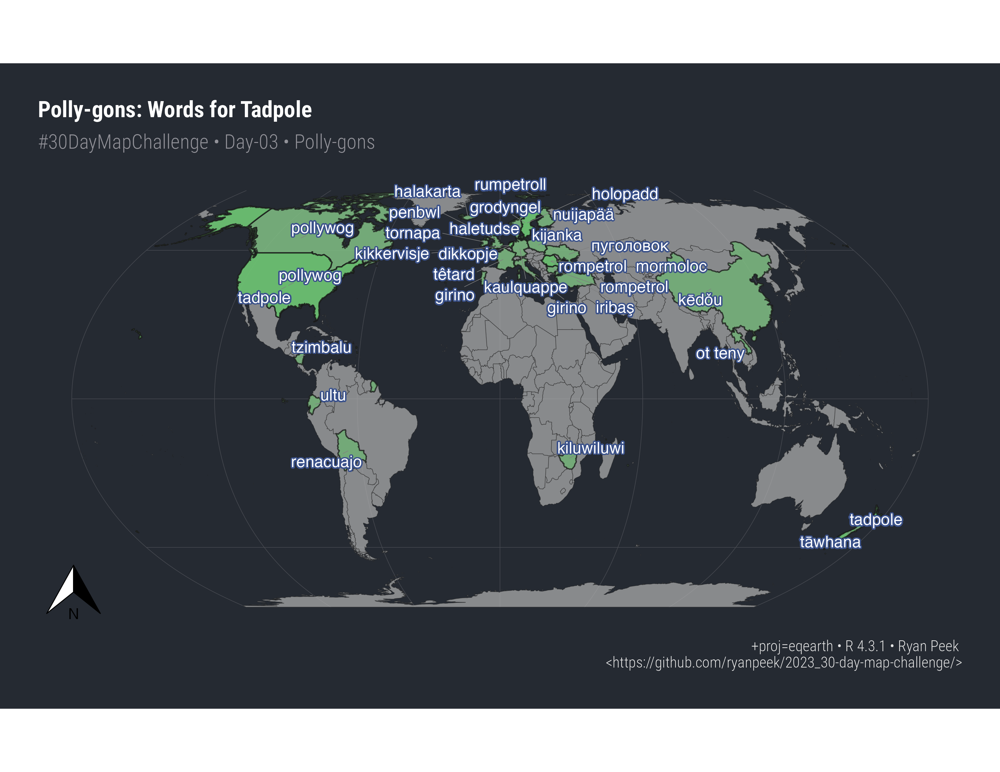

# 2023_30-day-map-challenge

[30-day map challenge](https://30daymapchallenge.com/)

*create maps based around different themes each day of November using the hashtag `#30DayMapChallenge`*

## Here's What I've Done

### Day-01

Where in the western US have porcupines been observed using {tigris} and {rinat} to gather boundaries and data points.

### Day-02

A flow-field/lines rendering of a photo of my grandmother in honor of Día de los Muertos.

### Day-03

Words for pollywog or tadpole across the world. The etymology may be rooted in Middle English, where `tadpole` is from *tadde* “toad” and *pol* “head”. For  `pollywog`, it's possibly from the *pol* "head" and *wyglen* “to wiggle”.

Expert sources were the internet, wikipedia, and dictionaries.

### Day-04

Timezones are scary. Having to switch our clocks twice a year is scarier.

### Day-05

When CA was an island...in 1650.

### Day-06

Light intensity at night in India, based on Nature article: https://www.nature.com/articles/s41597-020-0510-y.

### Day-07

Maps tell stories as well as help one navigate. While we have many maps of post-colonial trails, it is much harder to find data that documents Indigenous places, trails, and knowledge. It is not that these don't exist, they just don't get put on maps. 

A recent effort to provide an interactive GIS map of indigenous resources to help advance knowledge of Indigenous ancestral lands is called [Native Lands National Trails](https://experience.arcgis.com/experience/c98b415eb4b44081a6dcb9e824785846/page/NLNT-Homepage/). This is in part to help advance National Trails System knowledge of Indigenous ancestral Lands and increase partnerships and collaboration with Indigenous Communities along National Scenic and National Historic Trails.

I highly recommend checking out the map and reading the resources section and read the acknowledgement statement.^[Also look at the beautiful logo designed by Autry Lomahongva!].

### Day-08

African ocean currents!

### Day-09

30x30 Wildlife connectivity (in hexagons).

